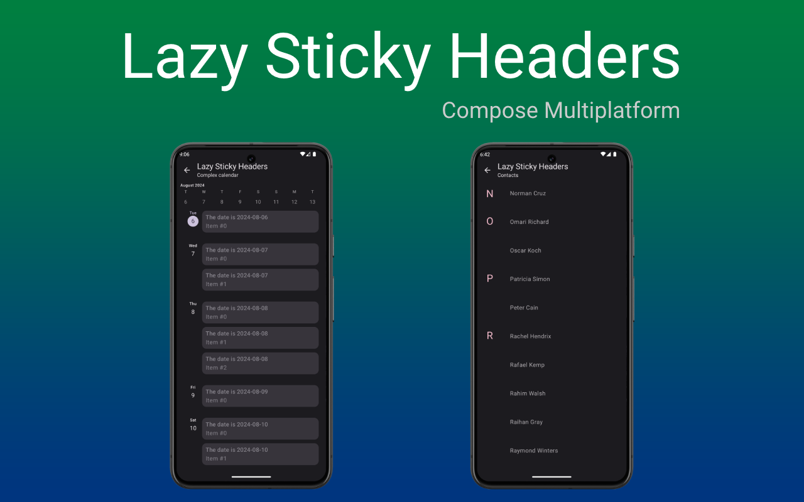

[](http://kotlinlang.org)
[](https://github.com/JetBrains/compose-multiplatform)
[](https://search.maven.org/search?q=g:me.gingerninja.lazy)
[](https://opensource.org/licenses/Apache-2.0)


# Lazy Sticky Headers

Compose Multiplatform library for adding sticky headers to lazy lists.

## Preview

<p align="center">


</p>

## Getting started

```kotlin
implementation("me.gingerninja.lazy:sticky-headers:0.1.0-alpha02")
```

<details>

<summary>Setup for multiplatform projects</summary>

If you target a subset of the library supported platforms, add the library to your common source set:

```kotlin
kotlin {
    sourceSets {
        commonMain.dependencies {
            implementation("me.gingerninja.lazy:sticky-headers:0.1.0-alpha02")
            // ...
        }
    }
    // ...
}
```

If you have targets that are not supported by the library,
add the library separately to each supported target:

```kotlin
kotlin {
    val desktopMain by getting {
        dependencies {
            implementation("me.gingerninja.lazy:sticky-headers:0.1.0-alpha02")
            // ...
        }
    }
    androidMain.dependencies {
        implementation("me.gingerninja.lazy:sticky-headers:0.1.0-alpha02")
        // ...
    }
    // other targets...
}
```

</details>

## Usage

```kotlin
StickyHeaders(
    state = listState, // from rememberLazyListState()
    key = {
        // sample keys: every 2 items will be grouped
        it.index / 2
    }
) { key ->
    Text("Key: $key")
}
```


The `StickyHeaders` is a container that holds the sticky items. This can be placed anywhere, such as in a `Box` overlaying the list items or in a `Row` / `Column` to align next to / over / under the list.

> ⚠️ It is _important_ to set the list state on both the `StickyHeaders` and the `LazyColumn` / `LazyRow`.

<details>

<summary>Example: usage with a LazyColumn in a Row</summary>

```kotlin
val listState = rememberLazyListState()

Row {
    StickyHeaders(
        state = listState,
        key = {
            it.index / 2
        },
    ) {
        Text("Key: ${it.key}")
    }

    LazyColumn(
        modifier = Modifier.weight(1f),
        state = listState,
    ) {
        items(count = 100) {
            Card {
                Text("Item $it", modifier = Modifier.padding(20.dp))
            }
        }
    }
}
```

</details>

See the [demo](demo) app for more elaborate samples.

## Known issues

- missing overscroll effect: [#1](https://github.com/gregkorossy/lazy-sticky-headers/issues/1)

## License

```text
Copyright 2024 Gergely Kőrössy

Licensed under the Apache License, Version 2.0 (the "License");
you may not use this file except in compliance with the License.
You may obtain a copy of the License at

    http://www.apache.org/licenses/LICENSE-2.0

Unless required by applicable law or agreed to in writing, software
distributed under the License is distributed on an "AS IS" BASIS,
WITHOUT WARRANTIES OR CONDITIONS OF ANY KIND, either express or implied.
See the License for the specific language governing permissions and
limitations under the License.
```